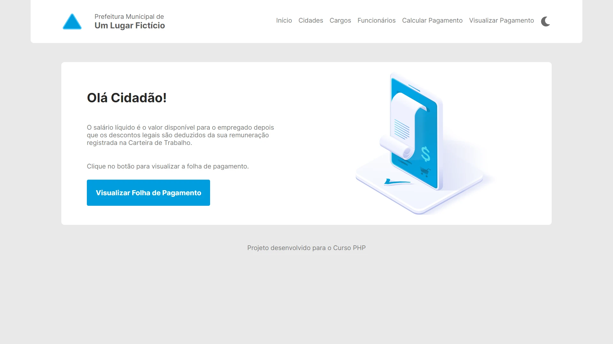
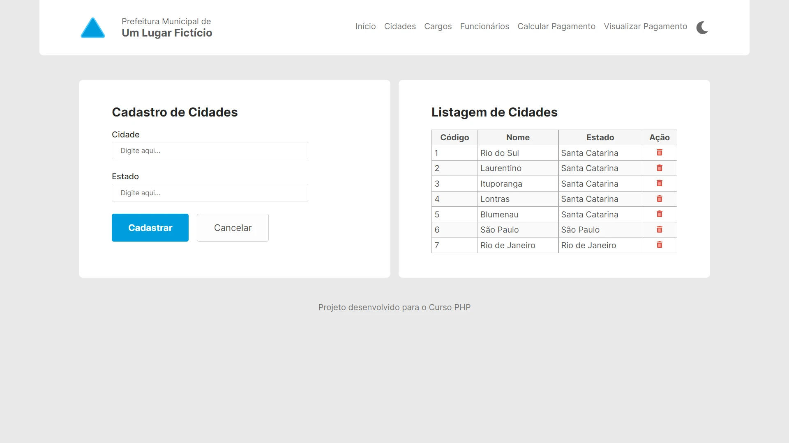
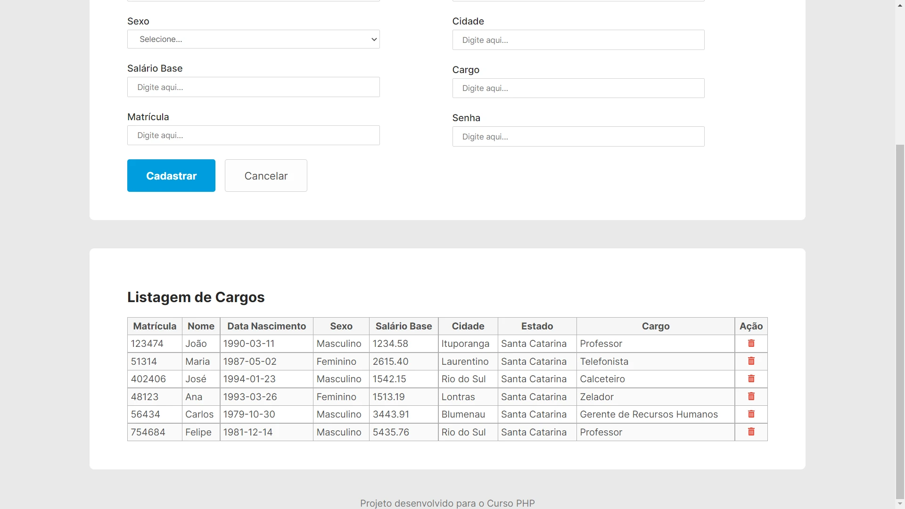
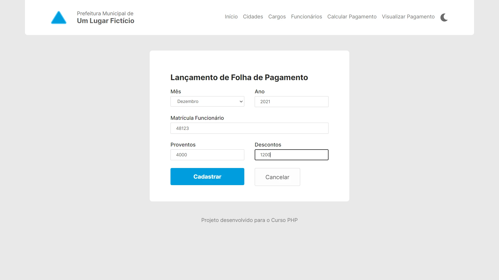
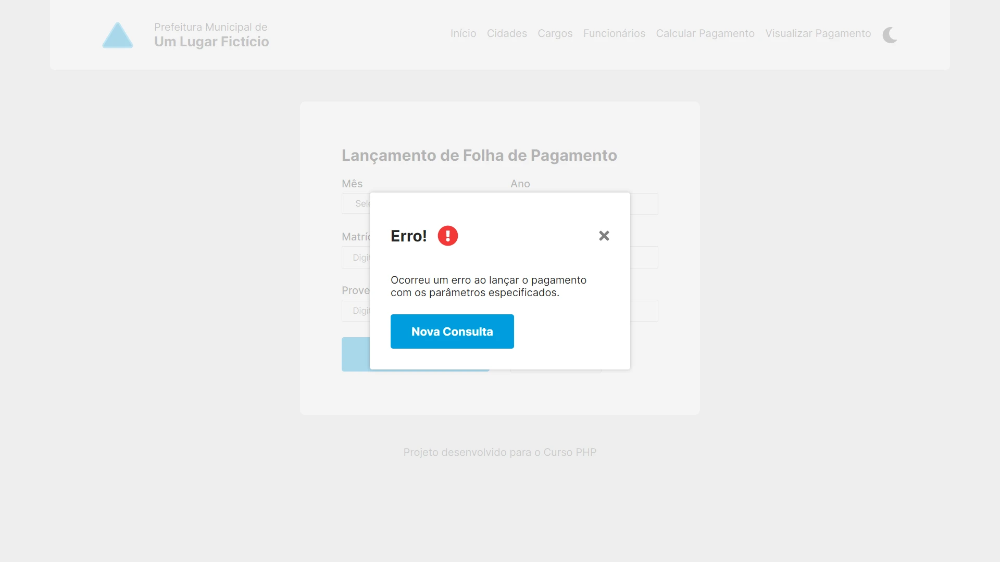
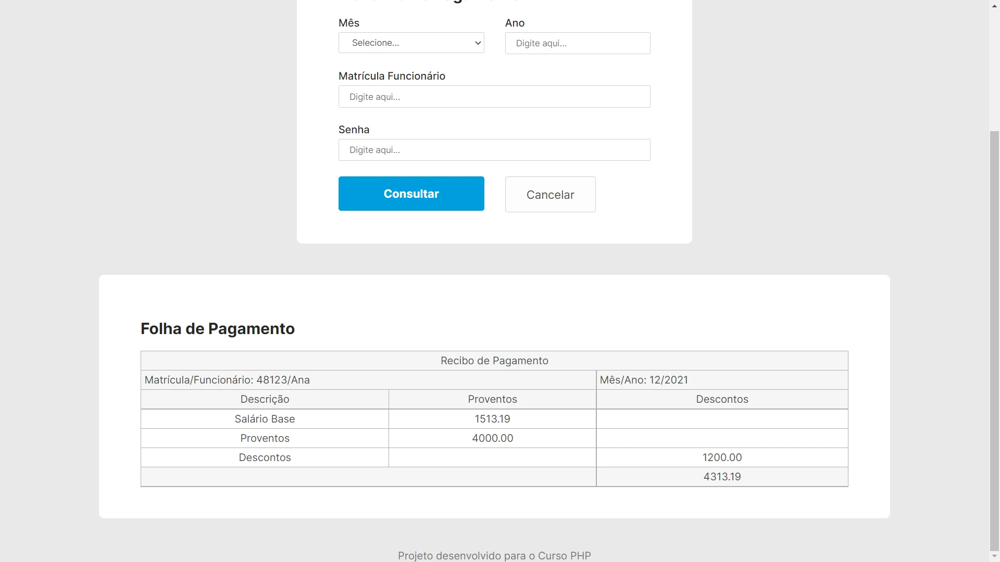

<h1 align="center">Projeto Curso PHP</h1>

<blockquote>
    <h6>Note for english speakers</h6>
    

        This project was used for teaching Junior devs basic PHP concepts for a company that I used to work for in Brazil. So, for that reason:
    

    <ul>
        <li>This project is only available in Brazilian Porgutuese.</li>
        <li>The code was purposely simplified and could be developed in a better way for non teaching purposes.</li>
    </ul>
    
</blockquote>

<h2>📜 Tabela de conteúdo</h2>

<ul>
    <li><a href="#about-the-project-br">Sobre o projeto</a></li>
    <li><a href="#live-demo-br">Live demo</a></li>
    <li><a href="#features-br">Funcionalidades</a></li>
    <li><a href="#front-end-br">Front-end</a></li>
    <ul>
        <li><a href="#layout-br">Layout</a></li>
    </ul>
    <li><a href="#back-end-br">Back-end</a></li>
    <li><a href="#database-br">Banco de dados</a></li>
    <li><a href="#how-to-set-up-br">Como configurar</a></li>
    <li><a href="#autor-br">Autores</a></li>
</ul>

<h2 id="about-the-project-br">💻 Sobre o projeto</h2>

    Este projeto era utilizado para ministrar as minhas aulas de introdução ao PHP para iniciantes em programação. Basicamente trata-se de um sistema de folha de pagamento simplificado de uma prefeitura fictícia.

    Esta aplicação web era desenvolvida ao longo de uma carga horária de 64 horas, que englobava HTML, PostgreSQL, PHP básico, comunicação entre PHP e banco de dados e programação orientada a objetos. Como o foco do curso em questão era o back-end, toda interface já tinha sido desenvolvida por mim antes do início das aulas, assim, os alunos focavam apenas em desenvolver a regra de negócio.

    A interface utilizada neste projeto foi idealizada pelo meu amigo <b>Amilton Schlemper - UI/UX Designer.</b> Você pode conferir a prototipação em detalhes no arquivo .fig, localizado na pasta <em>assets</em> deste repositório.

<h2 id="live-demo-br">🌐 Live demo</h2>

Veja este projeto rodando no <a href="https://curso-php-folha.herokuapp.com/">Heroku</a>

<h2 id="features-br">🔎 Funcionalidades</h2>

    As funcionalidades básicas desta aplicação são:

<ul>
    <li>Cadastro, remoção e listagem de cidades</li>
    <li>Cadastro, remoção e listagem de cargos</li>
    <li>Cadastro, remoção e listagem de funcionários</li>
    <li>Cálculo de pagamento de funcionário</li>
    <li>Consulta de pagamento de funcionário</li>
</ul>

<h2 id="front-end-br">Front-end</h2>

    O lado do cliente desta aplicação foi desenvolvido com HTML, e CSS,  contando com JavaScript apenas para pequenas manipulações.

<h3 id="layout-br">📐 Layout</h3>

Como a trilha de aprendizados era de fato o back-end, a aplicação conta apenas com interface desktop.

    
    

    
    

    
    

<h2 id="back-end-br">Back-end</h2>

    Esta aplicação foi escrita em Vanilla PHP, utilizando apenas o composer para fazer a inclusão automática das classes através do namespaces.

    Como o foco principal deste projeto é a <b>didática</b>, o mesmo foi desenvolvido de forma simplificada. Assim sendo, para fins de produção/comerciais, seu código fonte teria de ser refatorado e reescrito em uma arquitetura mais elaborada.

<h2 id="database-br">Banco de Dados</h2>

O banco de dados escolhido para desenvolver este projeto foi o <a href="https://www.postgresql.org/">PostgreSQL</a>. Veja a seguir uma breve descrição de suas tabelas:

<ul>
    <li><strong>tbcidade:</strong> armazena as cidades a serem vinculadas aos funcionários;</li>
    <li><strong>tbcargo:</strong> armazena os cargos a serem vinculados aos funcionários;</li>
    <li><strong>tbfuncionario:</strong> armazena os funcionários. Possui vinculo com a tabela tbcargo e tbcidade;</li>
    <li><strong>tbpagamento:</strong> armazena pagamentos realizados para os funcionários.</li>
</ul>

<h3 id="how-to-set-up-br">❓ Como configurar</h3>

Se você deseja fazer um <em>fork</em> deste projeto, você precisará configurar as seguintes variáveis de ambiente:

<ul>
    <li><strong>DATABASE_URL</strong> (String de conexão com o banco de dados)</li>
</ul>

<h3 id="autor-br">👩‍🦲 Autores</h3>

    Full stack  desenvolvido por <strong>Matheus do Livramento</strong>.

<a href="https://github.com/livramatheus">GitHub</a> | <a href="https://www.linkedin.com/in/livramatheus">LinkedIn</a> | <a href="https://www.livramento.dev/">Website</a>

    Interface do usuário criada por <strong>Amilton Schlemper</strong>.

<a href="https://dribbble.com/amilton-schlemper">Dribble</a> | <a href="https://www.linkedin.com/in/amilton-schlemper/">LinkedIn</a>
